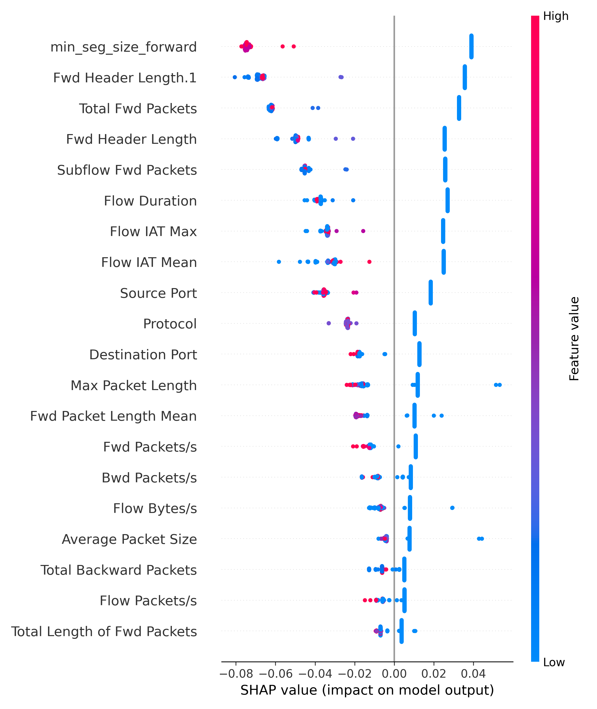
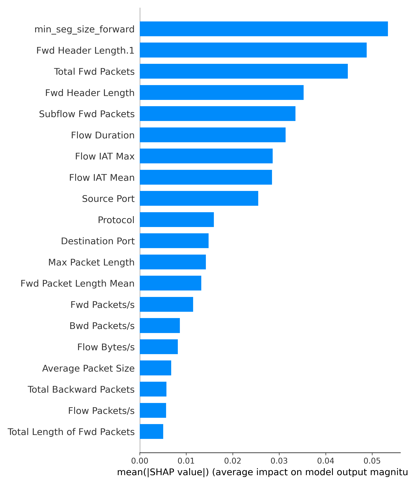

# Network Attack Detection using ML & SHAP

## Overview
This project is an AI-based cybersecurity framework for detecting malicious network traffic using Machine Learning and Explainable AI.

## Features
- Network attack detection using Random Forest
- SHAP-based explainability
- MITRE ATT&CK correlation
- CSV/PCAP support
- JSON report generation

## Technologies Used
- Python
- Scikit-learn
- Pandas
- NumPy
- SHAP
- PyShark
- Scapy

## Project Structure
- data/ → datasets
- models/ → trained models
- outputs/ → reports/results
- src/ → source code
- screenshots/ → output screenshots

## Screenshots

### SHAP Feature Importance

### SHAP Bar Graph
